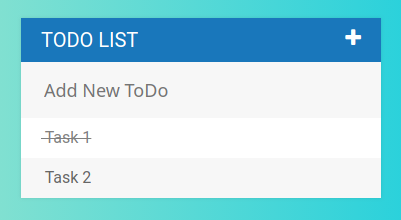

# toDo

toDo is an intuitive and easy to use online Todo list and Task Manager. It helps you to get organized and to get things done. Built with JQuery, HTML, and CSS.

 

### Features

* View tasks
* Add, remove, strike-through tasks

### Published on

[https://mthanasi.github.io/to-do-webapp/](https://mthanasi.github.io/to-do-webapp/)

### License

[MIT](https://choosealicense.com/licenses/mit/)
